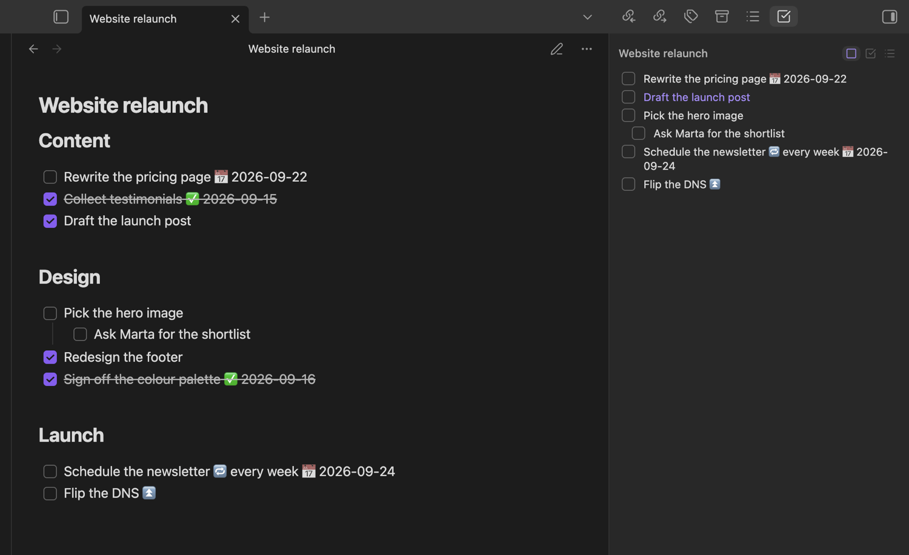
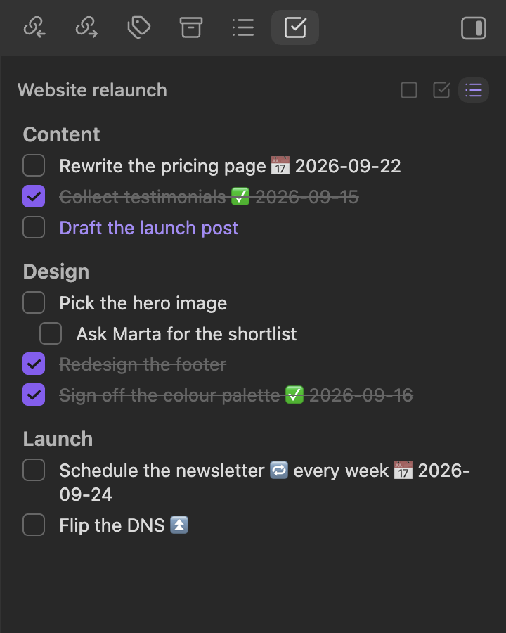
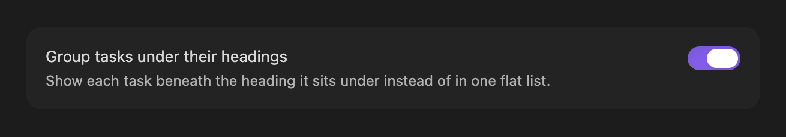

# Task Overview

An Obsidian sidebar panel that lists the tasks of the note you have in focus, so you can see and tick off a note's checkboxes without scrolling through it.



## What it does

The panel follows the note in focus the way the Calendar plugin follows the active date, so switching notes swaps the list and editing the note refreshes it. With no note in focus it says so instead of leaving the last note's tasks on screen.

Three filters sit above the list — open, completed or cancelled, and all — and each one carries a count taken from the note you are looking at, so you can tell how much is left before reading a single row.

Clicking a row opens the note and puts the cursor on that task's line, which makes the panel a table of contents for the work in a long note. Ticking a checkbox in the panel writes the change back to the file, so the note stays the single source of truth.

Turning on "Group tasks under their headings" splits the list by the nearest heading above each task, which keeps a note with several sections readable.





## Working alongside the Tasks plugin

Task Overview reads and writes plain Markdown checkboxes, and it recognises the statuses the [Tasks](https://github.com/obsidian-tasks-group/obsidian-tasks) plugin writes: `[/]` for in progress and `[-]` for cancelled are shown as their own states rather than being lumped in with open tasks.

When Tasks is installed, ticking a checkbox in the panel hands the toggle to that plugin, so its own rules for done dates and recurring tasks apply exactly as they would in the editor. When it is not installed, the panel flips `[ ]` to `[x]` itself. Nothing here depends on Tasks being present; the panel looks for it at runtime and falls back on its own.

## Installation

Once the plugin is listed in the community browser, open Settings → Community plugins → Browse, search for Task Overview, then install and enable it.

To install it by hand, download `main.js`, `manifest.json` and `styles.css` from a release, put them in `<vault>/.obsidian/plugins/task-overview/`, and enable Task Overview under Settings → Community plugins. It needs Obsidian 1.6.0 or later and runs on both desktop and mobile.

## Development

```bash
npm install
npm run dev     # watch build
npm run build   # typecheck + production bundle
npm test        # unit tests
```

Install into a test vault by symlinking the repository itself, so the build output the
plugin loads is always the one `npm run dev` just wrote:

```bash
ln -s "$PWD" "<vault>/.obsidian/plugins/task-overview"
```

Copying `main.js`, `manifest.json` and `styles.css` instead works once and then silently
freezes: the vault keeps serving that copy, and the [Hot
Reload](https://github.com/pjeby/hot-reload) plugin only watches plugin folders that are a
symlink or contain `.git` or `.hotreload`, so a copied folder never reloads either. With
the symlink in place, every `npm run dev` rebuild reloads the plugin in Obsidian.

## License

[MIT](LICENSE).
